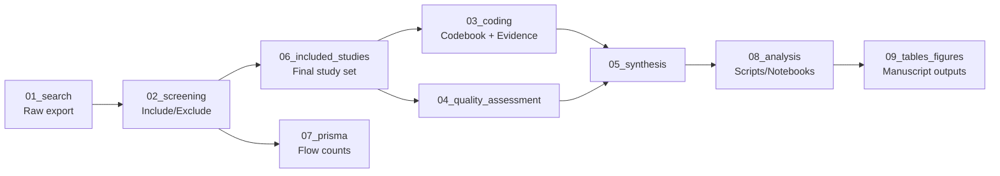

# SLR Cloud — Multi-Cloud Governance Evidence Repository

This repository is the evidence package supporting the systematic literature
review on **multi-cloud governance** that underpins the current ETECOM 2026
paper submission. It consolidates the search records, screening decisions,
quality appraisal, coding evidence, synthesis outputs, and derived figures that
were developed during the initial thesis-based research and subsequently
archived here for transparent, reproducible use.

> **Status:** The repository now contains the research evidence package for the
> ETECOM 2026 submission. The current artifacts reflect the completed study
> record, coding and synthesis evidence, and supporting material from the
> initial research effort, and this repository will continue to serve as the
> foundation for the later journal extension and future cloud-computing
> research work.

## Purpose

This repository is designed to support auditability, reproducibility, and
extension of the review findings by making every reported claim traceable to
its underlying evidence. The archive captures the complete chain from raw
candidate studies to synthesized findings, allowing an independent researcher
or reviewer to verify:

1. The exact search strategy and database export that identified each candidate
   study.
2. The screening decision and justification for inclusion or exclusion.
3. The coding decisions applied to each included study, linked to the relevant
   source page/section or quote from the original publication.
4. The quality assessment score used to weight evidence or assess study rigor.
5. The synthesized coverage matrix, governance gap taxonomy, and derived
   arguments that support the paper's conclusions.

The repository is therefore not a template scaffold; it is a maintained
research evidence archive that supports the current ETECOM 2026 manuscript and
provides a durable base for subsequent journal development and extended
empirical work.

## Directory Structure

| Directory | Contents | Raw / Derived |
|---|---|---|
| [01_search/](01_search/README.md) | Search strategy, search history log, raw database export(s) | **Raw / source** |
| [02_screening/](02_screening/README.md) | Title/abstract and full-text screening decisions, exclusion reasons | Derived from search results |
| [03_coding/](03_coding/README.md) | Codebook, coding scheme, and applied evidence per included study | Derived from included studies |
| [04_quality_assessment/](04_quality_assessment/README.md) | Study quality and rigor appraisal records | Derived from included studies |
| [05_synthesis/](05_synthesis/README.md) | Comparative coverage matrix, governance gap taxonomy, synthesis notes | Derived from coding evidence |
| [06_included_studies/](06_included_studies/README.md) | Final included study set and bibliographic summaries | Derived (filtered) from search + screening |
| [07_prisma/](07_prisma/README.md) | PRISMA flow counts at each stage | Derived (aggregated) from all stages |
| [08_analysis/](08_analysis/README.md) | Scripts/notebooks used to transform raw/coded inputs into tables and figures | Analysis code (not data) |
| [09_tables_figures/](09_tables_figures/README.md) | Source data and generated manuscript-ready outputs | Derived outputs |
| [docs/](docs/reproducibility.md) | Reproducibility workflow, data availability, and archival notes | Documentation |

## Research Workflow and Evidence Trail

1. **Search** — Candidate studies are identified and documented using the search
   strategy and raw export retained in [01_search/](01_search/README.md).
2. **Screening** — Each record is assessed for inclusion/exclusion in
   [02_screening/](02_screening/README.md), with reasons recorded according to
   the established exclusion scheme.
3. **Coding** — Included studies are coded against the review schema in
   [03_coding/](03_coding/README.md), with each decision supported by evidence
   drawn from the source publication.
4. **Quality Assessment** — Included studies are evaluated in
   [04_quality_assessment/](04_quality_assessment/README.md) to support study
   appraisal and synthesis weighting.
5. **Synthesis** — The coded evidence and quality appraisal are combined in
   [05_synthesis/](05_synthesis/README.md) into comparative findings and gap
   analysis.
6. **PRISMA reporting** — PRISMA counts are reported in
   [07_prisma/](07_prisma/README.md) to document the review flow.
7. **Analysis & outputs** — Processing scripts and notebooks in
   [08_analysis/](08_analysis/README.md) generate the manuscript-ready tables and
   figures in [09_tables_figures/](09_tables_figures/README.md).

See [docs/reproducibility.md](docs/reproducibility.md) for the workflow details
and [docs/data_availability.md](docs/data_availability.md) for the repository's
archival and data-sharing statement.

## Raw vs. Derived Data at a Glance

- **Raw / source data:** search export(s), bibliographic records, and source
  evidence retained in [01_search/](01_search/README.md)
- **Screening decisions:** records in [02_screening/](02_screening/README.md)
- **Coding scheme + evidence:** primary research artifact in [03_coding/](03_coding/README.md)
- **Quality appraisal:** records in [04_quality_assessment/](04_quality_assessment/README.md)
- **Synthesis outputs:** comparative and gap-oriented materials in [05_synthesis/](05_synthesis/README.md)
- **Final included-study bibliography:** included study set in [06_included_studies/](06_included_studies/README.md)
- **PRISMA reporting counts:** results in [07_prisma/](07_prisma/README.md)
- **Analysis code:** scripts and notebooks in [08_analysis/](08_analysis/README.md)
- **Manuscript-ready outputs:** tables/figures in [09_tables_figures/](09_tables_figures/README.md)

## License

See [LICENSE](LICENSE).

## Evidence Integrity and Future Extension

This repository now serves as the archival evidence base for the ETECOM 2026
submission and should be treated as a research record rather than a generic
template. To preserve the integrity of that record:

1. Keep the existing research artifacts and schema stable so that the evidence
   chain remains auditable.
2. Preserve the distinction between raw search evidence, screening records,
   coding evidence, and derived synthesis outputs.
3. When extending the review for future journal publication or follow-up
   studies, add new evidence and analyses in a way that does not overwrite the
   sourced records used for the current manuscript.
4. Update folder-level documentation whenever the schema or evidence structure
   changes, so the repository remains transparent and reproducible.
