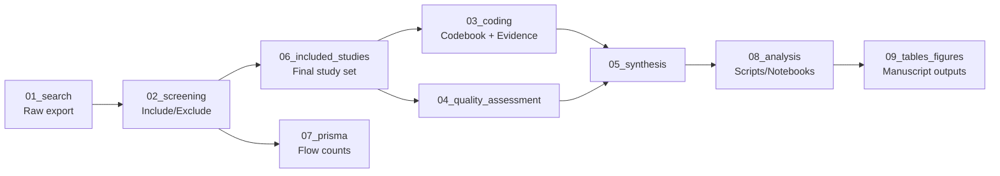

# SLR Cloud — Multi-Cloud Governance Systematic Literature Review

Reproducibility artifact accompanying a systematic literature review (SLR) on
**multi-cloud governance**. This repository contains the raw search exports,
screening decisions, coding scheme and evidence, quality assessment, synthesis
outputs, and the scripts/notebooks used to derive tables and figures for the
paper.

> **Status:** This is a template scaffold. All data files currently contain
> `TEMPLATE`/`EXAMPLE` rows only and must be replaced with the actual research
> artifacts before the repository is considered a complete reproducibility
> package.

## Purpose

This repository is designed to let an independent researcher reproduce, audit,
and extend the review's findings by tracing every reported claim back to:

1. The exact search query and database export that retrieved a candidate study.
2. The screening decision (include/exclude) and its justification.
3. The coding decisions applied to each included study, linked to the specific
   page/section of the source PDF that provides the supporting evidence.
4. The quality assessment score contributing to inclusion weight in synthesis.
5. The synthesis artifacts (coverage matrices, gap taxonomies) derived from
   the coded evidence.

## Directory Structure

| Directory | Contents | Raw / Derived |
|---|---|---|
| [01_search/](01_search/README.md) | Search strategy, search history log, raw EBSCO BibTeX export | **Raw / source** |
| [02_screening/](02_screening/README.md) | Title/abstract and full-text screening decisions, exclusion reasons | Derived from search results |
| [03_coding/](03_coding/README.md) | Codebook (scheme definition) and coding evidence (applied codes + evidence quotes/locations) | Derived from included studies |
| [04_quality_assessment/](04_quality_assessment/README.md) | Study quality/rigor appraisal | Derived from included studies |
| [05_synthesis/](05_synthesis/README.md) | Comparative coverage matrix, governance gap taxonomy, synthesis narrative | Derived from coding evidence |
| [06_included_studies/](06_included_studies/README.md) | Final included study set (bibliographic record + summary CSV) | Derived (filtered) from search + screening |
| [07_prisma/](07_prisma/README.md) | PRISMA flow counts at each stage | Derived (aggregated) from all stages |
| [08_analysis/](08_analysis/README.md) | Scripts/notebooks that compute derived outputs from the raw/coded data | Analysis code (not data) |
| [09_tables_figures/](09_tables_figures/README.md) | Source data and generated tables/figures for the manuscript | Derived outputs |
| [docs/](docs/reproducibility.md) | Reproducibility workflow and data availability statement | Documentation |

## Reproducibility Workflow

1. **Search** — Queries are executed against EBSCO (and any other databases
   used); the raw export is stored unmodified in `01_search/ebsco_export.bib`.
   The exact query strings and dates are logged in `search_strategy.md` and
   `search_history.xlsx`.
2. **Screening** — Each record from the search is screened for
   inclusion/exclusion in `02_screening/screening.xlsx`, with standardized
   exclusion reasons documented in `exclusion_reasons.md`.
3. **Coding** — Studies that pass screening are coded against the scheme
   defined in `03_coding/codebook.xlsx`. Each coding decision in
   `coding_evidence.xlsx` is traceable to a specific page/section/quote in the
   source study.
4. **Quality Assessment** — Each included study is appraised in
   `04_quality_assessment/quality_assessment.xlsx`.
5. **Synthesis** — Coded evidence and quality scores are aggregated into the
   comparative coverage matrix and governance gap taxonomy in `05_synthesis/`.
6. **PRISMA reporting** — Counts at every stage (identified, screened,
   eligible, included) are tallied in `07_prisma/prisma_counts.xlsx`.
7. **Analysis & outputs** — Scripts/notebooks in `08_analysis/` consume the
   files above (mainly `03_coding/`, `04_quality_assessment/`, `05_synthesis/`)
   to produce the manuscript tables and figures saved under
   `09_tables_figures/`.

See [docs/reproducibility.md](docs/reproducibility.md) for step-by-step
instructions and [docs/data_availability.md](docs/data_availability.md) for
the data availability statement.

## Raw vs. Derived Data at a Glance

- **Raw / source data:** `01_search/ebsco_export.bib`, `01_search/search_history.xlsx`
- **Screening decisions (first derived layer):** `02_screening/screening.xlsx`
- **Coding scheme + evidence (primary research artifact):** `03_coding/`
- **Quality appraisal:** `04_quality_assessment/quality_assessment.xlsx`
- **Synthesis (aggregated findings):** `05_synthesis/`
- **Final included-study bibliography:** `06_included_studies/`
- **PRISMA reporting counts:** `07_prisma/prisma_counts.xlsx`
- **Analysis code:** `08_analysis/` (not data — scripts/notebooks only)
- **Manuscript-ready outputs:** `09_tables_figures/`

## License

See [LICENSE](LICENSE).

## Replacing the Templates

Every `.xlsx`, `.csv`, and `.bib` file in this repository ships with header
rows and one or more rows marked `TEMPLATE` or `EXAMPLE` to illustrate the
expected structure. Before publishing this artifact:

1. Delete/replace all `TEMPLATE`/`EXAMPLE` rows with real data.
2. Keep the column headers and sheet names stable so downstream scripts in
   `08_analysis/` continue to work without modification.
3. Update the per-folder `README.md` files if you change the schema.
